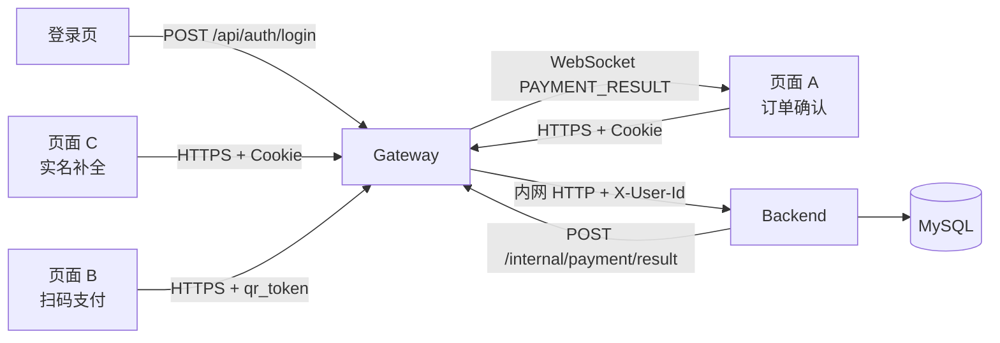

# 支付服务器项目文档

**文档版本**：v4.0（与当前代码实现对齐）  
**更新日期**：2026-07-13  
**项目名称**：paid_server — 游戏账号交易支付系统  
**数据库**：`game_account_exchange`  
**关联表**：`users`、`orders`、`accounts`、`account_rare_items`、`payment_sessions`、`payment_attempts`  
**技术栈**：C++17 自研 HTTP/WebSocket 服务 / Nginx 静态前端 / MySQL / OpenSSL JWT

> 本文档描述**当前已落地实现**的业务规则与代码架构。更细的逐步流程见各模块文档：
> - [网关业务流程](gateway/网关业务流程文档.md)
> - [后端业务流程](backend/后端业务流程文档.md)
> - [前端业务流程](frontend/前端业务流程文档.md)
> - [数据库表结构](数据库表结构/)

---

## 0. 本版文档目标

相对 v3.1（2026-06-19 规划稿），本版主要变化：

1. **架构已落地**：`frontend`（Nginx）→ `gateway`（鉴权/转发/WS 推送）→ `backend`（支付业务）→ MySQL，不再停留在单模块接口设计阶段。
2. **登录归网关**：`POST /api/auth/login`、`/api/auth/logout` 由网关直接处理，需登录接口通过 Cookie `session_id` 鉴权并注入 `X-User-Id` 请求头转发后端。
3. **一键运维**：`run_all.sh` 负责编译、启停 backend/gateway/nginx，配置统一由 `.env` 驱动。
4. **WebSocket 参数统一**：页面 A 绑定使用 `GET /ws/payment?payment_session_id={id}`（非旧文档中的 `?session=`）。
5. **会话存储现状**：网关 `session_store.hpp` 当前为进程内 Map；Redis 配置已预留，尚未接入。

---

## 1. 系统总体架构

### 1.1 部署拓扑

```text
浏览器
  │
  ▼
Nginx :9994（PAYMENT_NGINX_PORT）
  ├─ 静态页面：/login、/payment/confirm、/payment/scan、/user/real-auth/complete
  ├─ 反代 /api/*  → Gateway HTTP :9993
  └─ 反代 /ws/*   → Gateway WS   :9992
        │
        ▼
Gateway（payment_gateway）
  ├─ POST /api/auth/login|logout     网关本地处理（查 users、写 session Cookie）
  ├─ 需登录 /api/*                   验 Cookie → 加 X-User-Id → 转发 Backend :9990
  ├─ 免登录 /api/payment/page|attempt/init|pay  原样转发 Backend
  ├─ WS  /ws/payment                   维护 payment_session_id → 连接映射
  └─ POST /internal/payment/result     接收 Backend 支付成功回调，推送 WebSocket
        │
        ▼
Backend（payment_backend :9990）
  ├─ 6 个支付 API 业务实现（payment_impl.hpp）
  ├─ MySQL 连接池与事务（common/mysql_pool.hpp）
  └─ 支付成功后 HTTP 回调 Gateway /internal/payment/result
        │
        ▼
MySQL（game_account_exchange）
```

### 1.2 Mermaid 业务流



### 1.3 服务端口（默认，可在 `.env` 修改）

| 服务 | 环境变量 | 默认端口 | 说明 |
|------|----------|----------|------|
| Backend HTTP | `PAYMENT_BACKEND_HTTP_PORT` | 9990 | 内网支付 API |
| Backend WS | `PAYMENT_BACKEND_WEBSOCKET_PORT` | 9991 | 预留，未启用 |
| Gateway WS | `PAYMENT_GATEWAY_WEBSOCKET_PORT` | 9992 | 支付结果推送 |
| Gateway HTTP | `PAYMENT_GATEWAY_HTTP_PORT` | 9993 | 对外 API |
| Nginx | `PAYMENT_NGINX_PORT` | 9994 | 静态页 + 反代 |

---

## 2. 代码目录与模块职责

```text
paid_http/
├── backend/
│   ├── common/
│   │   ├── config.hpp              # 读取 .env
│   │   ├── jwt.hpp                 # qr_token 签发/验签；邮箱/身份证 HMAC
│   │   ├── logger.hpp              # spdlog，敏感字段脱敏
│   │   ├── mysql_pool.hpp          # 连接池 + 各表 DAO + 支付成功事务
│   │   ├── password_verifier.hpp   # HMAC-SHA256 登录密码校验
│   │   └── gateway_notify.hpp      # 支付成功后回调网关
│   ├── payment_impl.hpp            # 6 个支付 API 实现
│   └── main.cpp                    # 自研 HTTP 服务入口
├── gateway/
│   ├── common/
│   │   ├── config.hpp
│   │   ├── logger.hpp
│   │   ├── session_store.hpp       # session_id → user_id（当前内存 Map）
│   │   ├── http_forwarder.hpp      # 转发 /api/* 到 Backend
│   │   ├── ws_registry.hpp         # payment_session_id → WebSocket 连接
│   │   ├── mysql_pool.hpp          # 登录时查 users
│   │   └── password_verifier.hpp
│   ├── gateway_impl.hpp            # 登录/登出、鉴权转发、WS 绑定、结果推送
│   └── main.cpp                    # HTTP + WebSocket 双监听
├── frontend/
│   ├── pages/                      # login / payment_confirm / payment_scan / real_auth_complete
│   ├── common/                     # api.js、config.js、二维码渲染
│   └── nginx.conf.template         # 由 run_all.sh 渲染为 .run/nginx/nginx.conf
├── 数据库表结构/                    # 各表设计说明
├── sql_create_and_add/             # 建表 + 测试数据脚本
├── run_all.sh                      # build / up / down / status
├── .env.example                    # 配置模板（已脱敏）
└── README.md                       # 项目概览与快速开始
```

### 2.1 请求处理分工

| 入口 | 处理方 | 代码位置 |
|------|--------|----------|
| `POST /api/auth/login` | 网关 | `gateway/gateway_impl.hpp` |
| `POST /api/auth/logout` | 网关 | `gateway/gateway_impl.hpp` |
| `GET /api/payment/orders/{order_sn}` | 网关鉴权 → 后端 | `gateway_impl.hpp` → `payment_impl.hpp` |
| `POST /api/payment/confirm` | 网关鉴权 → 后端 | 同上 |
| `POST /api/users/real-auth/complete` | 网关鉴权 → 后端 | 同上 |
| `GET /api/payment/page` | 网关转发 → 后端 | 同上 |
| `POST /api/payment/attempt/init` | 网关转发 → 后端 | 同上 |
| `POST /api/payment/pay` | 网关转发 → 后端 | 同上 |
| `GET /ws/payment` | 网关 | `gateway_impl.hpp` + `ws_registry.hpp` |
| `POST /internal/payment/result` | 网关 | `gateway_impl.hpp` |

后端通过请求头 `X-User-Id` 获取当前登录用户（由网关在需登录接口注入）。

---

## 3. 数据库表职责

| 表名 | 中文名称 | 当前职责 |
|------|----------|----------|
| `users` | 用户表 | 登录名、密码哈希、邮箱/身份证哈希与脱敏值、实名状态、用户类型与状态 |
| `orders` | 交易订单表 | 订单交易事实；支付服务只读取和更新状态，不负责创建订单 |
| `accounts` | 游戏账号商品表 | 账号商品信息；支付成功后更新为已售出 |
| `account_rare_items` | 账号珍稀道具明细表 | 珍稀道具检索与展示 |
| `payment_sessions` | 支付会话表 | 关联页面 A、二维码、页面 B 与 WebSocket 推送 |
| `payment_attempts` | 支付尝试记录表 | 幂等控制、失败记录与审计 |

---

## 4. 关键业务结论

### 4.1 三页面职责

| 页面 | 路径 | 职责 |
|------|------|------|
| 页面 A | `/payment/confirm?order_sn=` | 订单确认、勾选协议、继续支付、展示二维码、WebSocket 等结果 |
| 页面 B | `/payment/scan?token=` | 扫码支付、输入登录密码完成支付 |
| 页面 C | `/user/real-auth/complete` | 补全邮箱与身份证号后跳回页面 A |
| 登录页 | `/login` | 网关登录，写入 `session_id` Cookie |

### 4.2 实名补全前置

页面 A 点击继续支付时，后端必须先检查用户是否已补全邮箱号和身份证号。未补全则返回错误码 `40910`，前端引导至页面 C，**不得**创建支付会话或二维码。

### 4.3 登录密码即支付密码

当前版本**不单独设置支付密码**。页面 B 提交 `login_password`，后端读取 `users.password_hash`，使用 `HMAC-SHA256(plain_password, PASSWORD_HASH_SECRET)` 校验。

禁止：保存/记录/返回 `login_password`；返回 `password_hash`；与固定字符串比较。

### 4.4 敏感信息存储

| 字段 | 规则 |
|------|------|
| 邮箱 | `email_hash = HMAC-SHA256(email_normalized, USER_EMAIL_HASH_SECRET)`，明文不落库 |
| 身份证 | `id_card_hash = HMAC-SHA256(id_card_normalized, USER_ID_CARD_HASH_SECRET)`，明文不落库 |
| 二维码 | `qr_token` 为 JWT，不落库；验签 + 查 `payment_sessions` 双重校验 |
| `request_id` | 后端生成，前端只负责携带 |

---

## 5. 核心业务流程

### 5.1 登录（网关）

```http
POST /api/auth/login
{"username":"","password":""}
```

1. 网关校验参数非空。
2. 查 `users`，用 `password_verifier.hpp` 校验密码。
3. 生成 `session_id`，写入 `session_store`（内存 Map）。
4. `Set-Cookie: session_id=...; HttpOnly; SameSite=Lax`。
5. 返回 `{"code":0,...}`。

### 5.2 页面 A 获取订单

```http
GET /api/payment/orders/{order_sn}
```

网关：验 Cookie → 注入 `X-User-Id` → 转发后端。

后端处理：

1. 从 `X-User-Id` 获取当前用户。
2. 查 `orders`，校验 `orders.buyer_id == current_user_id`。
3. 查 `accounts`，返回订单与账号展示信息。

### 5.3 页面 A 继续支付

```http
POST /api/payment/confirm
{"order_sn":"","agreement_checked":true}
```

后端处理顺序：

1. 校验 `agreement_checked == true`。
2. 查 `users`，校验状态与实名信息（邮箱/身份证哈希非空）。
3. 查 `orders`、`accounts`，校验归属与可支付状态。
4. 未实名 → 返回 `40910` + `complete_real_auth_url`。
5. 已实名 → 创建或复用 `payment_sessions`，生成 `qr_token`、`qr_payload`、`websocket_url`。

返回示例：

```json
{
  "code": 0,
  "data": {
    "payment_session_id": "PS...",
    "qr_token": "eyJ...",
    "qr_payload": "http://<nginx>/payment/scan?token=eyJ...",
    "websocket_url": "ws://<nginx>/ws/payment?payment_session_id=PS..."
  }
}
```

### 5.4 实名补全（页面 C）

```http
POST /api/users/real-auth/complete
{"email":"","id_card":"","return_url":""}
```

1. 标准化邮箱/身份证号，计算 HMAC 哈希与脱敏值。
2. 更新 `users` 相关字段，设置 `real_auth_completed = 1`。
3. 返回 `redirect_url`，前端跳回页面 A。

未补全时的响应：

```json
{
  "code": 40910,
  "message": "请先完善邮箱号和身份证号后继续支付",
  "data": {
    "action": "COMPLETE_USER_REAL_AUTH",
    "missing_fields": ["email", "id_card"],
    "complete_real_auth_url": "/user/real-auth/complete?return_url=...",
    "return_url": "/payment/confirm?order_sn=..."
  }
}
```

### 5.5 页面 A WebSocket 绑定

```http
GET /ws/payment?payment_session_id={id}
```

网关处理：

1. WebSocket 握手。
2. 校验 `payment_session_id` 格式。
3. 建立 `payment_session_id → connection` 映射。
4. 推送 `{"type":"BIND_SUCCESS","payment_session_id":"..."}`。
5. 页面 A 收到 `BIND_SUCCESS` 后再渲染二维码。

### 5.6 页面 B 获取支付页

```http
GET /api/payment/page?token={qr_token}
```

1. 验签 `qr_token`，解析 `payment_session_id`。
2. 查 `payment_sessions`、`orders`、`accounts`。
3. 校验未过期、未支付、账号可交易。

### 5.7 初始化支付尝试

```http
POST /api/payment/attempt/init
{"qr_token":""}
```

1. 验签 `qr_token`，校验会话与订单状态。
2. 生成 `request_id`，插入 `payment_attempts`（`result = 0`）。
3. 返回 `request_id`；同一次支付重试须复用同一 `request_id`。

### 5.8 页面 B 提交支付

```http
POST /api/payment/pay
{"request_id":"","qr_token":"","login_password":""}
```

1. 查 `payment_attempts` 做幂等（已成功/已失败直接返回）。
2. 验签 `qr_token`，校验会话、订单、账号、用户实名状态。
3. 读取 `users.password_hash`，校验 `login_password`。
4. 校验通过 → 进入支付成功事务；失败 → 更新 `payment_attempts` 失败状态。

### 5.9 支付成功事务

在一个 MySQL 事务内，按顺序 `FOR UPDATE` 锁定并更新：

```text
payment_sessions → orders → accounts → payment_attempts
```

- `orders.status` → 已支付
- `accounts.status` → 已售出
- `payment_sessions.status` → 已支付
- `payment_attempts.result` → 成功

实现位于 `backend/common/mysql_pool.hpp` 的 `finalizePaymentSuccess`。

### 5.10 WebSocket 支付结果推送

事务提交成功后，后端 HTTP 回调网关：

```http
POST /internal/payment/result
```

```json
{
  "type": "PAYMENT_RESULT",
  "payment_session_id": "PS...",
  "order_sn": "ORD...",
  "payment_status": "PAID",
  "message": "支付成功"
}
```

网关通过 `ws_registry.hpp` 查找连接并推送给页面 A。

---

## 6. API 汇总

统一响应：`{"code":0,"message":"","data":{}}`

| 接口 | 方法 | 处理方 | 需登录 | 说明 |
|------|------|--------|--------|------|
| `/api/auth/login` | POST | 网关 | 否 | 登录，写 Cookie |
| `/api/auth/logout` | POST | 网关 | 否 | 登出，清 Cookie |
| `/api/payment/orders/{order_sn}` | GET | 网关→后端 | 是 | 订单确认页数据 |
| `/api/payment/confirm` | POST | 网关→后端 | 是 | 继续支付，创建会话 |
| `/api/users/real-auth/complete` | POST | 网关→后端 | 是 | 实名补全 |
| `/api/payment/page` | GET | 网关→后端 | 否 | 扫码支付页数据 |
| `/api/payment/attempt/init` | POST | 网关→后端 | 否 | 生成 request_id |
| `/api/payment/pay` | POST | 网关→后端 | 否 | 提交登录密码支付 |
| `/ws/payment` | WebSocket | 网关 | 否 | 绑定会话，收推送 |
| `/internal/payment/result` | POST | 网关 | 内网 | 后端回调触发推送 |

---

## 7. 核心代码实现映射

### 7.1 Backend（`payment_impl.hpp` + `common/`）

| 业务能力 | 实现位置 |
|----------|----------|
| 订单查询 | `handleGetOrder` → `mysql_pool.hpp` |
| 继续支付 / 实名检查 | `handleConfirmPayment` |
| 实名补全 | `handleCompleteRealAuth` → `jwt.hpp` 哈希辅助 |
| 支付页加载 | `handleGetPaymentPage` → `jwt.hpp` 验签 |
| 支付尝试初始化 | `handleInitPaymentAttempt` |
| 支付提交与幂等 | `handlePay` → `password_verifier.hpp` |
| 支付成功事务 | `mysql_pool.hpp::finalizePaymentSuccess` |
| 通知网关推送 | `gateway_notify.hpp` |

### 7.2 Gateway（`gateway_impl.hpp` + `common/`）

| 业务能力 | 实现位置 |
|----------|----------|
| 登录 / 登出 | `handleLogin` / `handleLogout` |
| Cookie 鉴权 | `requireUserId` → `session_store.hpp` |
| API 转发 | `http_forwarder.hpp` |
| WebSocket 绑定与推送 | `ws_registry.hpp` |
| 内网支付结果接收 | `handleInternalPaymentResult` |

### 7.3 Frontend

| 页面 | 文件 | 关键交互 |
|------|------|----------|
| 登录 | `pages/login.html` | `POST /api/auth/login` |
| 页面 A | `pages/payment_confirm.html` | 订单查询、confirm、WebSocket、40910 跳转 |
| 页面 B | `pages/payment_scan.html` | page → attempt/init → pay |
| 页面 C | `pages/real_auth_complete.html` | real-auth/complete → redirect |

公共封装：`common/api.js`（`fetch` + Cookie）、`common/config.js`（网关地址）。

---

## 8. 核心校验规则

### 8.1 页面 A 继续支付

```text
agreement_checked == true
users.status == 0
users 邮箱/身份证哈希与脱敏字段非空（或 real_auth_completed == 1）
orders.buyer_id == current_user_id
orders.status == 0
accounts 状态允许交易
orders.price 为最终交易价
```

### 8.2 页面 B 支付

```text
request_id 存在且属于当前 payment_session_id
qr_token 验签通过
payment_sessions 未过期、status == 0
orders.status == 0
accounts 可交易
users 状态正常且已完成实名
login_password 与 password_hash 校验通过
```

---

## 9. 错误码

| 错误码 | 含义 |
|--------|------|
| `0` | 成功 |
| `40001` | 参数错误 |
| `40005` | 邮箱格式错误 |
| `40006` | 身份证号格式错误 |
| `40101` | 登录态无效 |
| `40102` | 二维码 Token 无效 |
| `40103` | 二维码 Token 已过期 |
| `40301` | 用户状态不允许支付 |
| `40401` | 订单不存在 |
| `40403` | 用户不存在 |
| `40404` | 支付尝试不存在 |
| `40901` | 订单状态不允许支付 |
| `40910` | 用户未补全邮箱号或身份证号 |
| `40911` | 支付会话不存在或已失效 |
| `40912` | 支付请求不存在或已处理 |
| `41001` | 支付会话已过期 |
| `41002` | 登录密码校验失败 |
| `50001` | 后端服务异常 |
| `50002` | 数据库异常 |
| `50003` | WebSocket 推送失败 |

---

## 10. 安全要求

1. 浏览器只访问 Nginx（:9994），不直连 Backend（:9990）。
2. 前端不持有任何 Hash Secret / JWT Secret。
3. `qr_token`、`request_id` 均由后端生成。
4. 登录密码仅在 `POST /api/payment/pay` 请求内短暂使用，禁止落库、写日志、返回前端。
5. 邮箱、身份证号明文不落库；日志仅记录脱敏值。
6. 支付成功必须单事务更新四张核心表。
7. 需登录接口由网关统一鉴权，后端信任 `X-User-Id`（内网转发）。

---

## 11. 实现状态（截至 2026-07-13）

| 模块 | 状态 | 说明 |
|------|------|------|
| Backend 6 个支付 API | ✅ 已实现 | `payment_impl.hpp` |
| Gateway 登录/登出 | ✅ 已实现 | `gateway_impl.hpp` |
| Gateway 鉴权转发 | ✅ 已实现 | Cookie + `X-User-Id` |
| Gateway WebSocket 推送 | ✅ 已实现 | `ws_registry.hpp` |
| Frontend 四页面 | ✅ 已实现 | Nginx 托管 |
| MySQL 建表与测试数据 | ✅ 已提供 | `sql_create_and_add/` |
| 一键启停 | ✅ 已实现 | `run_all.sh` |
| 会话存储 Redis 化 | ⏳ 待做 | 当前内存 Map |
| 网关限流 | ⏳ 待做 | 配置已预留 |
| Backend WS :9991 | ⏳ 预留 | 未启用 |

---

## 12. 本地运行

```bash
# 依赖（Ubuntu/Debian）
sudo apt install -y build-essential cmake libssl-dev libmysqlclient-dev \
  libspdlog-dev nlohmann-json3-dev nginx mysql-client

cp .env.example .env    # 填写 MySQL 与密钥
bash sql_create_and_add/setup_mysql_test_data.sh
./run_all.sh up
```

日志：`.run/logs/backend.log`、`gateway.log`、`nginx_*.log`

---

## 13. 最终落地结论

1. 系统按 **Nginx + Gateway + Backend** 三层部署，职责清晰分离。
2. 页面 A 继续支付前必须完成邮箱 + 身份证实名；否则返回 `40910` 引导补全。
3. 支付确认复用登录密码，`HMAC-SHA256` 哈希校验，无独立支付密码。
4. `qr_token`（JWT）+ `payment_sessions` 关联页面 A/B；`request_id` 保证支付幂等。
5. 支付成功在单事务中更新 `orders`、`accounts`、`payment_sessions`、`payment_attempts`。
6. 支付结果经 Backend 回调 Gateway，再通过 WebSocket 实时推送至页面 A。

---

## 14. 后续规划

- [ ] `session_store` 迁移至 Redis
- [ ] 网关限流与完善错误码体系
- [ ] 启用 Backend WebSocket 端口（9991）
- [ ] 生产环境 HTTPS 与独立支付密码 / MFA 升级方案
