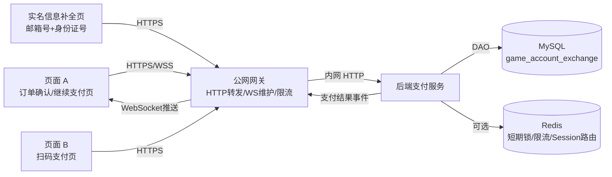

# 支付服务器项目文档（最终版）

**文档版本**：v3.1-最终版  
**生成日期**：2026-06-19  
**项目名称**：游戏账号交易支付服务器  
**数据库**：`game_account_exchange`  
**当前关联 SQL 表结构**：`users`、`orders`、`accounts`、`account_rare_items`、`payment_sessions`、`payment_attempts`  
**实现方向**：C++ 后端支付服务 / C++ 网关 / MySQL / WebSocket / JWT

---

## 0. 本版文档目标

本文档作为当前支付服务器功能实现最终版，优先描述**功能如何实现**，部署细节、压测规范、完整日志规范和完整异常矩阵可在后续工程文档中补充。

本版重点覆盖以下变更：

2. 当前阶段实名认证使用：**邮箱号 + 身份证号**。
3. `users` 表中现有 `email_hash`、`email_masked` 字段当前阶段实际承载邮箱哈希和脱敏邮箱展示值。
4. `users` 表新增 `id_card_hash`、`id_card_masked`、`real_auth_completed`，用于支撑身份证号补全、实名状态判断和支付前置校验。
5. 用户在页面 A 勾选 **“我已清晰账号对应全部信息，同意继续支付”** 并点击继续支付后，后端需要先检查用户是否已具备邮箱号和身份证号实名信息。
6. 如果用户缺少邮箱号或身份证号，后端返回需要补全实名信息的响应，前端引导用户进入实名信息补全页面。
7. 用户补全邮箱号和身份证号后，后端保存哈希值和脱敏值，再返回跳转链接，引导用户回到页面 A。
8. 当前系统不单独设置独立支付密码。支付确认阶段复用用户登录密码进行校验，由支付服务接收本次请求提交的 `login_password`，读取 `users.password_hash`，使用密码哈希校验函数完成登录密码比对。

---

## 1. 当前数据库表职责

| 表名                 | 中文名称           | 当前职责                                                                                                                                                         |
| :------------------- | :----------------- | :--------------------------------------------------------------------------------------------------------------------------------------------------------------- |
| `users`              | 用户表             | 保存用户业务 ID、登录名、登录密码哈希、邮箱哈希、脱敏邮箱、身份证号哈希、脱敏身份证号、实名状态、用户类型和用户状态；当前阶段用于支撑邮箱号 + 身份证号实名认证。 |
| `orders`             | 交易订单表         | 保存订单交易事实，支付服务只读取和更新订单状态，不负责创建订单。                                                                                                 |
| `accounts`           | 游戏账号商品表     | 保存游戏账号商品信息，支付成功后更新账号状态为已售出。                                                                                                           |
| `account_rare_items` | 账号珍稀道具明细表 | 保存账号珍稀道具明细，用于珍稀道具检索。                                                                                                                         |
| `payment_sessions`   | 支付会话表         | 保存页面 A、二维码、页面 B 和 WebSocket 推送之间的支付会话关系。                                                                                                 |
| `payment_attempts`   | 支付尝试记录表     | 保存页面 B 每一次支付提交动作，用于幂等、失败记录和审计排查。                                                                                                    |

---

## 2. 本次需求变更后的关键结论

### 2.1 页面 A 的职责变化

页面 A 是订单继续支付确认页。

页面 A 展示：

| 展示项         | 数据来源                                               |
| :------------- | :----------------------------------------------------- |
| 订单号         | `orders.order_sn`                                      |
| 游戏账号 ID    | `orders.account_id`                                    |
| 账号基础信息   | `accounts`                                             |
| 珍稀道具展示   | `accounts.rare_items`，复杂检索走 `account_rare_items` |
| 商品价格       | `orders.price` 为最终交易价                            |
| 用户确认勾选框 | 前端提交，后端必须校验                                 |

页面 A 用户动作：

```text
勾选：我已清晰账号对应全部信息，同意继续支付
点击：继续支付
```

点击后，前端向后端提交继续支付请求。

后端不能直接生成二维码，而是必须先检查：

```text
用户是否存在
用户状态是否正常
订单是否属于当前用户
用户是否已有邮箱号
用户是否已补全身份证号
订单是否可支付
账号是否可交易
用户是否已勾选确认声明
```

说明：当前阶段统一使用邮箱号和身份证号完成支付前置实名校验。

---

### 2.2 用户实名信息补全逻辑

如果后端查询 `users` 表发现当前用户缺少邮箱号或身份证号信息，则返回：

```text
NEED_USER_REAL_AUTH_COMPLETION
```

前端收到该响应后，展示提示：

```text
请先完善邮箱号和身份证号后继续支付。
```

并跳转到用户实名信息补全页。

用户在补全页提交：

```text
邮箱号
身份证号
```

请求经由：

```text
前端 -> 网关 -> 后端支付服务 / 用户信息服务
```

后端完成邮箱号和身份证号保存后，返回页面 A 跳转链接，例如：

```text
/payment/confirm?order_sn=ORD20260619000123456789
```

用户跳回页面 A 后，再次勾选确认声明并点击继续支付，后端重新执行支付前置校验。校验通过后，才创建或复用 `payment_session_id` 并返回二维码信息。

---

### 2.3 登录密码校验逻辑变化

页面 B 不再使用固定支付密码 `123456`，当前系统也**不单独设置独立支付密码**。

当前版本规定：

```text
支付确认阶段复用用户登录密码进行校验。
登录密码校验由支付服务直接完成。
支付服务接收本次请求提交的 login_password。
支付服务读取 users.password_hash。
支付服务使用密码哈希校验函数验证 login_password 与 users.password_hash 是否匹配。
```

推荐交互方式：

1. 页面 B 展示支付页后，先调用 POST /api/payment/attempt/init，由后端生成 request_id。
2. 用户在页面 B 输入登录密码进行支付确认。
3. 前端将 request_id、qr_token、login_password 提交到支付服务接口 POST /api/payment/pay。
4. 支付服务根据 qr_token 解析并校验 payment_session_id。
5. 支付服务根据 request_id 查询 payment_attempts，校验本次支付请求上下文是否合法。
6. 支付服务根据 payment_session_id 查询 payment_sessions，再关联查询 orders、accounts 和 users。
7. 支付服务读取 users.password_hash，使用密码哈希校验函数验证用户输入的 login_password 是否正确。
8. 登录密码校验通过后，支付服务进入支付成功事务。
9. 登录密码校验失败时，支付服务拒绝支付，并记录本次 payment_attempts 的失败结果或失败原因。

禁止：

```text
禁止把登录密码与固定字符串比较。
禁止保存登录密码明文。
禁止把 login_password 写入日志。
禁止返回 users.password_hash 给前端。
禁止从 password_hash 反推出明文密码。
禁止把 login_password 持久化到数据库。
禁止在错误信息中暴露密码校验细节。
```

说明：
该方案用于降低当前开发复杂度。该设计不符合生产级支付安全最佳实践，但当前阶段可以作为简化实现方案。后续如果业务需要，可以升级为独立支付密码、邮箱验证码、TOTP、设备确认或其他多因素支付确认机制。

---

## 3. 数据库表结构适配说明

### 3.3 邮箱号和身份证号哈希规则

邮箱号哈希：

```text
email_hash = HMAC-SHA256(email_normalized, USER_EMAIL_HASH_SECRET)
```

身份证号哈希：

```text
id_card_hash = HMAC-SHA256(id_card_normalized, USER_ID_CARD_HASH_SECRET)
```

以下密钥必须分开：

| 环境变量                   | 用途             |
| :------------------------- | :--------------- |
| `USER_EMAIL_HASH_SECRET`   | 计算邮箱号哈希   |
| `USER_ID_CARD_HASH_SECRET` | 计算身份证号哈希 |

禁止复用 `JWT_SECRET` 作为上述哈希密钥。

邮箱标准化规则：

```text
去除首尾空格
统一转小写
```

身份证号标准化规则：

```text
去除首尾空格
统一转大写
校验长度和格式
```

---

## 4. 系统总体架构



说明：当前版本不单独拆分认证服务处理支付确认。登录密码校验直接由支付服务完成。支付服务只在本次支付确认请求内短暂接收 `login_password`，读取 `users.password_hash`，并使用密码哈希校验函数完成比对。支付服务禁止保存、记录或返回登录密码明文。

---

## 5. 核心业务流程

## 5.1 页面 A 打开订单确认页

页面 A 根据 `order_sn` 获取订单确认页数据。

接口：

```http
GET /api/payment/orders/{order_sn}
```

后端处理：

1. 从登录态中获取当前用户 `current_user_id`。
2. 查询 `orders`。
3. 校验订单存在。
4. 校验 `orders.buyer_id == current_user_id`。
5. 查询 `accounts`。
6. 返回订单号、账号信息、价格、账号展示信息。

返回示例：

```json
{
  "code": 0,
  "message": "success",
  "data": {
    "order_sn": "ORD20260619000123456789",
    "account_id": "ACC20260619000123456789",
    "game_name": "王者荣耀",
    "server_area": "微信区",
    "price": 9900,
    "display_price": "99.00",
    "rare_items": ["龙狙", "火麒麟"],
    "order_status": 0,
    "account_status": 1
  }
}
```

---

## 5.2 页面 A 点击继续支付

接口：

```http
POST /api/payment/confirm
```

请求：

```json
{
  "order_sn": "ORD20260619000123456789",
  "agreement_checked": true
}
```

后端处理顺序：

1. 从登录态中获取当前用户 `current_user_id`。
2. 校验 `agreement_checked == true`。
3. 查询 `users`。
4. 校验用户存在。
5. 校验 `users.status == 0`。
6. 校验用户是否已补全邮箱号和身份证号。
7. 查询 `orders`。
8. 校验订单存在。
9. 校验 `orders.buyer_id == current_user_id`。
10. 校验 `orders.status == 0`。
11. 查询 `accounts`。
12. 校验 `accounts.account_id == orders.account_id`。
13. 校验账号状态允许交易。
14. 校验 `orders.price` 为最终交易金额。
15. 创建或复用 `payment_sessions`。
16. 生成 `qr_token`。
17. 返回 `payment_session_id`、`qr_token`、`qr_payload`、`websocket_url`。

---

## 5.3 用户未补全邮箱号或身份证号时的返回

如果用户没有邮箱号或身份证号，后端不创建支付会话，不生成二维码，直接返回：

```json
{
  "code": 40910,
  "message": "请先完善邮箱号和身份证号后继续支付",
  "data": {
    "action": "COMPLETE_USER_REAL_AUTH",
    "missing_fields": ["email", "id_card"],
    "complete_real_auth_url": "/user/real-auth/complete?return_url=/payment/confirm?order_sn=ORD20260619000123456789",
    "return_url": "/payment/confirm?order_sn=ORD20260619000123456789"
  }
}
```

前端处理：

1. 弹出提示：请先完善邮箱号和身份证号后继续支付。
2. 展示“去完善信息”按钮。
3. 用户点击后进入 `complete_real_auth_url`。

---

## 5.4 用户实名信息补全流程

接口：

```http
POST /api/users/real-auth/complete
```

请求：

```json
{
  "email": "user@example.com",
  "id_card": "440300199901010000",
  "return_url": "/payment/confirm?order_sn=ORD20260619000123456789"
}
```

后端处理：

1. 从登录态中获取当前用户 `current_user_id`。
2. 校验邮箱格式。
3. 校验身份证号格式。
4. 标准化邮箱号和身份证号。
5. 计算邮箱哈希：`HMAC-SHA256(email_normalized, USER_EMAIL_HASH_SECRET)`。
6. 计算身份证号哈希：`HMAC-SHA256(id_card_normalized, USER_ID_CARD_HASH_SECRET)`。
7. 生成脱敏邮箱展示值。
8. 生成脱敏身份证号展示值。
9. 更新 `users.email_hash`。
10. 更新 `users.email_masked`。
11. 更新 `users.id_card_hash`。
12. 更新 `users.id_card_masked`。
13. 设置 `users.real_auth_completed = 1`。
14. 返回页面 A 的跳转链接。

返回：

```json
{
  "code": 0,
  "message": "success",
  "data": {
    "redirect_url": "/payment/confirm?order_sn=ORD20260619000123456789"
  }
}
```

注意：

```text
邮箱号和身份证号明文只允许在本次请求内短暂使用。
禁止保存明文身份证号。
禁止在日志中打印完整邮箱号和完整身份证号。
```

---

## 5.5 支付会话创建流程

用户补全实名信息后，再次在页面 A 点击继续支付。

后端校验通过后创建或复用 `payment_sessions`。

创建规则：

```text
同一个 order_sn 当前版本只允许存在一个 payment_session_id。
如果已存在未支付、未过期会话，则复用。
如果已支付、已失效或已过期，则拒绝或按业务规则重新生成。
```

`payment_sessions` 写入内容：

| 字段                 | 来源                   |
| :------------------- | :--------------------- |
| `payment_session_id` | 后端生成               |
| `order_sn`           | `orders.order_sn`      |
| `account_id`         | `orders.account_id`    |
| `buyer_id`           | `orders.buyer_id`      |
| `buyer_email`        | `users.email_masked`   |
| `status`             | 0-待支付               |
| `expire_at`          | 当前时间 + 默认 5 分钟 |

返回：

```json
{
  "code": 0,
  "message": "success",
  "data": {
    "payment_session_id": "PS20260619000123456789",
    "order_sn": "ORD20260619000123456789",
    "price": 9900,
    "display_price": "99.00",
    "qr_token": "eyJhbGciOiJIUzI1NiIs...",
    "qr_payload": "https://pay.example.com/pay?token=eyJhbGciOiJIUzI1NiIs...",
    "websocket_url": "wss://gateway.example.com/ws/payment?session=PS20260619000123456789"
  }
}
```

---

## 5.6 页面 A WebSocket 绑定流程

页面 A 收到 `payment_session_id` 后建立 WebSocket：

```http
GET /ws/payment?session=PS20260619000123456789
```

网关处理：

1. 校验 `payment_session_id` 格式。
2. 可调用后端查询支付会话是否存在且未过期。
3. 建立内存 Session Map：

```text
payment_session_id -> websocket_connection_set
connection_id -> payment_session_id
```

绑定成功推送：

```json
{
  "type": "BIND_SUCCESS",
  "payment_session_id": "PS20260619000123456789"
}
```

页面 A 收到 `BIND_SUCCESS` 后再渲染二维码。

---

## 5.7 页面 B 获取支付页数据

用户扫码进入页面 B。

接口：

```http
GET /api/payment/page?token={qr_token}
```

后端处理：

1. 验签 `qr_token`。
2. 解析 `payment_session_id`。
3. 查询 `payment_sessions`。
4. 查询 `orders` 和 `accounts`。
5. 校验会话未过期、订单未支付、账号未售出。
6. 返回订单金额和支付页信息。

返回：

```json
{
  "code": 0,
  "message": "success",
  "data": {
    "payment_session_id": "PS20260619000123456789",
    "order_sn": "ORD20260619000123456789",
    "price": 9900,
    "display_price": "99.00",
    "status": "WAITING_PAY"
  }
}
```

---

## 5.8 初始化支付请求 request_id

页面 B 展示支付页后，应先向后端申请本次支付提交的 `request_id`。

接口：

```http
POST /api/payment/attempt/init
```

请求：

```json
{
  "qr_token": "eyJhbGciOiJIUzI1NiIs..."
}
```

后端处理：

1. 验签 `qr_token`。
2. 查询 `payment_sessions`。
3. 校验支付会话状态为 `0-待支付`。
4. 校验未过期。
5. 查询 `orders` 和 `accounts`。
6. 校验订单和账号状态。
7. 后端生成 `request_id`。
8. 可先插入 `payment_attempts`，`result = 0`。
9. 返回 `request_id`。

返回：

```json
{
  "code": 0,
  "message": "success",
  "data": {
    "request_id": "REQ20260619000123456789"
  }
}
```

说明：

```text
request_id 由后端生成，前端只负责携带。
同一次支付请求重试必须复用同一个 request_id。
新的支付尝试必须重新向后端申请新的 request_id。
```

---

## 5.9 页面 B 登录密码支付校验

当前系统不单独设置支付密码。页面 B 在正式提交支付时，直接要求用户输入账号登录密码。

当前版本不再调用独立认证服务接口，也不再签发 `payment_auth_token`。

页面 B 支付确认请求直接提交到：

```http
POST /api/payment/pay
```

请求必须携带：

```json
{
  "request_id": "REQ20260619000123456789",
  "qr_token": "eyJhbGciOiJIUzI1NiIs...",
  "login_password": "用户输入的账号登录密码"
}
```

支付服务处理原则：

1. `login_password` 只允许在当前请求内短暂使用。
2. 支付服务根据 `qr_token` 和 `request_id` 校验支付上下文。
3. 支付服务查询 `payment_sessions`、`orders`、`accounts` 和 `users`。
4. 支付服务读取 `users.password_hash`。
5. 支付服务使用密码哈希校验函数验证 `login_password` 与 `users.password_hash` 是否匹配。
6. 登录密码校验失败时，支付服务直接拒绝支付。
7. 登录密码校验成功后，支付服务进入支付成功事务。

禁止：

1. 禁止新增 `/api/auth/payment/reauth` 接口。
2. 禁止使用 `payment_auth_token`。
3. 禁止保存 `login_password`。
4. 禁止记录 `login_password`。
5. 禁止返回 `password_hash`。
6. 禁止把 `login_password` 与固定字符串比较。

---

## 5.10 页面 B 提交支付确认

接口：

```http
POST /api/payment/pay
```

请求：

```json
{
  "request_id": "REQ20260619000123456789",
  "qr_token": "eyJhbGciOiJIUzI1NiIs...",
  "login_password": "用户输入的账号登录密码"
}
```

支付服务处理：

1. 根据 `request_id` 查询 `payment_attempts`。
2. 如果 `request_id` 不存在，拒绝请求。
3. 如果 `result = 1`，直接返回支付成功。
4. 如果 `result = 2`，返回原失败原因。
5. 如果 `result = 0`，继续处理。
6. 验签 `qr_token`。
7. 解析 `payment_session_id`。
8. 查询 `payment_sessions`。
9. 校验 `request_id` 属于当前 `payment_session_id`。
10. 校验 `payment_sessions.status == 0`。
11. 校验 `payment_sessions.expire_at > NOW()`。
12. 查询 `orders`。
13. 校验 `orders.status == 0`。
14. 查询 `accounts`。
15. 校验 `accounts.status IN (0, 1)`。
16. 查询 `users`。
17. 校验用户存在。
18. 校验用户状态为正常。
19. 校验用户已完成邮箱号和身份证号实名认证。
20. 读取 `users.password_hash`。
21. 使用密码哈希校验函数验证 `login_password` 与 `users.password_hash` 是否匹配。
22. 如果登录密码校验失败，则拒绝支付，并更新或保留 `payment_attempts` 失败状态。
23. 如果登录密码校验成功，则进入支付成功事务。

禁止：

1. 禁止 `POST /api/payment/pay` 接收 `pay_password`。
2. 禁止使用 `payment_auth_token`。
3. 禁止保存 `login_password` 明文。
4. 禁止把 `login_password` 写入日志。
5. 禁止把 `users.password_hash` 返回给前端。
6. 禁止从 `users.password_hash` 反推出明文密码。

## 5.11 支付成功事务

支付成功必须在一个 MySQL 事务内完成。

推荐锁顺序：

```text
payment_sessions -> orders -> accounts -> payment_attempts
```

事务伪代码：

```sql
BEGIN;

SELECT * FROM payment_sessions
WHERE payment_session_id = ?
FOR UPDATE;

SELECT * FROM orders
WHERE order_sn = ?
FOR UPDATE;

SELECT * FROM accounts
WHERE account_id = ?
FOR UPDATE;

SELECT * FROM payment_attempts
WHERE request_id = ?
FOR UPDATE;

-- 校验 login_password 已通过 users.password_hash 哈希校验
-- 校验 payment_sessions.status = 0
-- 校验 payment_sessions.expire_at > NOW()
-- 校验 orders.status = 0
-- 校验 accounts.status IN (0, 1)
-- 校验 orders.price 为最终交易价格
-- 校验 payment_attempts.result = 0
-- 校验 users.status = 0
-- 校验 users.real_auth_completed = 1 或动态判断邮箱号、身份证号均存在

UPDATE orders
SET status = 1,
    paid_at = NOW(),
    update_time = NOW()
WHERE order_sn = ?
  AND status = 0;

UPDATE accounts
SET status = 2,
    version = version + 1,
    updated_at = NOW()
WHERE account_id = ?
  AND status IN (0, 1);

UPDATE payment_sessions
SET status = 1,
    updated_at = NOW()
WHERE payment_session_id = ?
  AND status = 0;

UPDATE payment_attempts
SET result = 1,
    updated_at = NOW()
WHERE request_id = ?
  AND result = 0;

COMMIT;
```

如果任何一步失败：

```sql
ROLLBACK;
```

并根据失败原因更新或保留 `payment_attempts` 状态。

---

## 5.12 WebSocket 支付结果推送

事务提交成功后，后端向网关发送支付成功事件：

```json
{
  "type": "PAYMENT_RESULT",
  "payment_session_id": "PS20260619000123456789",
  "order_sn": "ORD20260619000123456789",
  "payment_status": "PAID",
  "message": "支付成功",
  "paid_at": "2026-06-19T12:01:30"
}
```

网关根据：

```text
payment_session_id -> websocket_connection_set
```

找到页面 A 连接并推送。

页面 A 收到推送后展示支付成功。

---

## 6. API 汇总

| 接口                                       | 方法      | 作用                                                                                                          |
| :----------------------------------------- | :-------- | :------------------------------------------------------------------------------------------------------------ |
| `/api/payment/orders/{order_sn}`           | GET       | 页面 A 获取订单确认页数据                                                                                     |
| `/api/payment/confirm`                     | POST      | 页面 A 点击继续支付，检查邮箱号和身份证号实名信息并创建或复用支付会话                                         |
| `/api/users/real-auth/complete`            | POST      | 用户补全邮箱号和身份证号实名认证信息                                                                          |
| `/ws/payment?session={payment_session_id}` | WebSocket | 页面 A 绑定支付会话，等待支付结果推送                                                                         |
| `/api/payment/page?token={qr_token}`       | GET       | 页面 B 获取支付页数据                                                                                         |
| `/api/payment/attempt/init`                | POST      | 页面 B 初始化支付请求，后端生成 `request_id`                                                                  |
| `/api/payment/pay`                         | POST      | 页面 B 携带 `request_id`、`qr_token`、`login_password` 提交支付确认，由支付服务完成登录密码哈希校验和支付事务 |

---

## 7. 数据访问层与服务层必须实现的方法

### 7.1 支付服务 DAO / Service 方法

```cpp
UserInfo getUserById(const std::string& user_id);
bool isUserRealAuthCompleted(const std::string& user_id);
bool updateUserRealAuthProfile(const UserRealAuthUpdate& input);

OrderInfo getOrderBySn(const std::string& order_sn);
AccountInfo getAccountById(const std::string& account_id);

PaymentSessionInfo getPaymentSessionById(const std::string& payment_session_id);
PaymentSessionInfo createOrReusePaymentSession(const CreatePaymentSessionInput& input);
bool markPaymentSessionPaid(const std::string& payment_session_id);

std::string initPaymentAttempt(const InitPaymentAttemptInput& input);
PaymentAttemptInfo getPaymentAttemptByRequestId(const std::string& request_id);
bool markPaymentAttemptSuccess(const std::string& request_id);
bool markPaymentAttemptFailed(const std::string& request_id, const std::string& fail_reason);

bool verifyLoginPasswordWithHash(const std::string& plain_password,
                                 const std::string& password_hash);
```

### 7.2 登录密码校验实现归属

当前版本不单独实现认证服务支付再认证接口。

登录密码校验直接归属于支付服务，由支付服务在 `POST /api/payment/pay` 处理流程中完成。

支付服务必须实现：

```cpp
UserInfo getUserById(const std::string& user_id);

bool verifyLoginPasswordWithHash(const std::string& plain_password,
                                 const std::string& password_hash);
```

说明：

1. `plain_password` 来自页面 B 本次请求提交的 `login_password`。
2. `password_hash` 来自 `users.password_hash`。
3. 支付服务只允许在当前请求内短暂使用 `plain_password`。
4. 支付服务禁止保存、记录、返回 `plain_password`。
5. 支付服务禁止返回 `users.password_hash`。
6. 支付服务禁止从 `password_hash` 反推出明文密码。

---

## 8. 核心校验规则

### 8.1 页面 A 继续支付校验

必须校验：

```text
agreement_checked == true
users.status == 0
users.email_hash 不为空
users.email_masked 不为空
users.id_card_hash 不为空
users.id_card_masked 不为空
users.real_auth_completed == 1，或根据上述字段动态判断已完成实名信息
orders.buyer_id == users.user_id
orders.status == 0
accounts.account_id == orders.account_id
accounts.status IN (0, 1)
orders.price 为最终交易价
```

### 8.2 页面 B 支付校验

必须校验：

```text
request_id 存在且属于当前 payment_session_id
qr_token 验签通过
payment_sessions.status == 0
payment_sessions.expire_at > NOW()
orders.status == 0
accounts.status IN (0, 1)
users.status == 0
users.email_hash 不为空
users.id_card_hash 不为空
request_id 存在且属于当前 payment_session_id
qr_token 验签通过
payment_sessions.status == 0
payment_sessions.expire_at > NOW()
orders.status == 0
accounts.status IN (0, 1)
users.status == 0
users.email_hash 不为空
users.id_card_hash 不为空
login_password 与 users.password_hash 哈希校验通过
```

---

## 9. 错误码建议

| 错误码  | 含义                       |
| :------ | :------------------------- |
| `0`     | 成功                       |
| `40001` | 参数错误                   |
| `40005` | 邮箱格式错误               |
| `40006` | 身份证号格式错误           |
| `40101` | 登录态无效                 |
| `40102` | 二维码 Token 无效          |
| `40103` | 二维码 Token 已过期        |
| `40104` | 支付密码错误               |
| `40301` | 用户状态不允许支付         |
| `40302` | 不允许外网调用             |
| `40400` | 接口不存在                 |
| `40401` | 订单不存在                 |
| `40402` | 账号不存在                 |
| `40403` | 用户不存在                 |
| `40404` | 支付尝试不存在             |
| `40901` | 订单状态不允许支付         |
| `40902` | 订单已支付                 |
| `40903` | 账号不可交易               |
| `40904` | 支付尝试失败               |
| `40905` | 支付会话无效               |
| `40910` | 用户未补全邮箱号或身份证号 |
| `40911` | 支付会话不存在或已失效     |
| `40912` | 支付请求不存在或已处理     |
| `41001` | 支付会话已过期             |
| `41002` | 登录密码校验失败           |
| `42901` | 请求过于频繁               |
| `50001` | 后端服务异常               |
| `50002` | 数据库异常                 |
| `50003` | WebSocket 推送失败         |

---

## 10. 安全要求

1. 前端不能直接访问后端支付服务，只能访问网关。
2. 前端不能直接访问 MySQL。
3. 前端不能持有 JWT Secret、QR Token Hash Secret、邮箱 Hash Secret、身份证 Hash Secret。
4. `qr_token` 必须由后端签发。
5. `request_id` 必须由后端生成。
6. 当前系统不单独设置支付密码，支付确认阶段复用登录密码进行一次性校验。
7. 登录密码校验由支付服务直接完成，支付服务接收本次请求提交的 `login_password`，读取 `users.password_hash`，并使用密码哈希校验函数完成比对。
8. 支付服务禁止保存、记录、返回 `login_password`；禁止把 `login_password` 写入日志；禁止把 `users.password_hash` 返回给前端。
9. 当前版本不使用 `payment_auth_token`，也不单独实现 `/api/auth/payment/reauth` 支付再认证接口。
10. 邮箱号不作为明文唯一校验字段，唯一校验使用 `email_hash`，当前语义为邮箱哈希。
11. 身份证号不保存明文。
12. 日志中只能记录脱敏邮箱号、脱敏身份证号。
13. 支付成功必须使用事务，不能分散更新。

---

## 11. 最小实现顺序

建议按以下顺序实现：

1. 确认正式版 `users` 表已经包含身份证实名字段：`id_card_hash`、`id_card_masked`、`real_auth_completed`。
2. 明确当前版本 `users.email_hash` / `users.email_masked` 的业务语义为邮箱哈希 / 脱敏邮箱。
3. 实现 `getUserById()`。
4. 实现 `isUserRealAuthCompleted()`。
5. 实现 `POST /api/users/real-auth/complete`，完成邮箱号和身份证号实名信息补全。
6. 改造 `POST /api/payment/confirm`，增加邮箱号和身份证号实名信息检查。
7. 实现 `payment_sessions` 创建或复用。
8. 实现二维码 `qr_token` 生成和
9. 实现页面 A WebSocket 绑定。
10. 实现 `POST /api/payment/attempt/init`，由后端生成 `request_id`。
11. 在支付服务中实现登录密码哈希校验方法，使用 `users.password_hash` 验证页面 B 提交的 `login_password`。
12. 改造 `POST /api/payment/pay`，接收 `request_id`、`qr_token`、`login_password`，不再接收 `pay_password` 或 `payment_auth_token`。
13. 实现支付成功事务。
14. 实现 WebSocket 支付结果推送。
15. 补充错误码、日志脱敏、限流和超时处理。

---

## 12. 最终落地结论

本项目最终按以下方案落地：

1. 页面 A 点击继续支付前，后端必须先检查用户邮箱号和身份证号实名信息是否已补全。
2. 用户未补全实名信息时，后端返回实名信息补全链接，不得继续创建支付会话和二维码。
3. 用户补全邮箱号和身份证号后，前端应跳转回页面 A，由用户重新勾选确认声明并再次发起继续支付。
4. 当前版本中，`users.email_hash` / `users.email_masked` 暂时承载邮箱哈希和脱敏邮箱语义。
5. 正式版 `users` 表已经包含 `id_card_hash`、`id_card_masked`、`real_auth_completed` 三个身份证实名认证字段。
6. `id_card_hash` 使用唯一索引，限制同一身份证号只能绑定一个用户账号。
7. 当前系统不单独设置支付密码，支付确认阶段采用登录密码再认证机制。
8. 登录密码校验由支付服务直接完成，支付服务接收页面 B 本次请求提交的 `login_password`，读取 `users.password_hash`，并使用密码哈希校验函数完成比对。
9. 当前版本不使用 `payment_auth_token`，也不单独实现认证服务支付再认证接口；`login_password` 只允许在当前请求内短暂使用，禁止保存、记录或返回。
10. `request_id` 由后端生成，前端只负责携带和复用。
11. 支付成功必须在同一事务中更新 `orders`、`accounts`、`payment_sessions`、`payment_attempts`。
12. WebSocket 只负责页面 A 支付结果推送，不承担支付事实存储。
